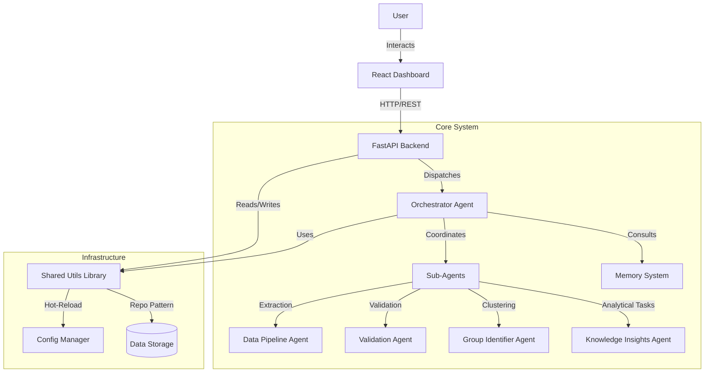

# Agentic Tracking System

## Index

- [Executive Summary](#executive-summary)
- [System Architecture](#system-architecture)
- [Key Features](#key-features)
- [Component Overview](#component-overview)
- [Getting Started](#getting-started)
  - [Prerequisites](#prerequisites)
  - [Installation](#installation)
  - [Running the System](#running-the-system)
- [Configuration](#configuration)
- [Development](#development)
- [License](#license)

## Executive Summary

The **Agentic Tracking System** is a sophisticated, multi-agent platform designed to monitor, analyze, and manage complex workflows in real-time. It combines a high-performance **FastAPI** backend, a premium **React** dashboard, and an orchestrated fleet of **AI Agents** to provide intelligent insights and automated control.

The system utilizes a **Smol Agents** framework, emphasizing an **Insight-First** resolution policy and a modular **Memory System** for cohesive long-running interactions.

---

## System Architecture

The system follows a modular micro-services architecture, orchestrated by a central intelligent agent with a dedicated memory layer.



---

## Key Features

-   **Orchestrated Agentic Workflows**
    A central Orchestrator agent intelligently routes tasks using a **Tool-Calling** approach. It prioritizes existing insights through an "Insight-First" policy, escalating to complex multi-agent workflows only when necessary.

-   **Intelligent Memory System**
    Features a robust memory layer supporting **Short-Term Memory** with conversation isolation. This ensures context is maintained across multiple turns while keeping independent sessions secure and private.

-   **Robust Data Pipeline & Repositories**
    Utilizes a unified **Repository Pattern** to handle multiple data formats (`JSON`, `JSONL`, `CSV`, `ICS`) seamlessly. Features an enhanced storage layer with automatic schema detection and specialized handlers like the iCalendar event monitor.

-   **Background Event Scheduling**
    A persistent, fully configurable background task that monitors calendar events (ICS). It automatically triggers orchestrator workflows when events reach their end time, ensuring autonomous and timely data updates.

-   **Dynamic "Hot-Reload" Configuration**
    A thread-safe configuration manager that supports real-time updates without system downtime. Includes dot-notation access for complex settings and secure environment variable integration.

-   **"Deep Ocean" Dashboard**
    A stunning, high-performance interface built with React and Vite. Features glassmorphism effects, interactive D3-based analytics, and a responsive layout for monitoring system health.

---

## Component Overview

| Component | Directory | Description |
| :--- | :--- | :--- |
| **Dashboard** | [`/dashboard`](./dashboard/README.md) | The "Deep Ocean" frontend. React + Vite + Tailwind CSS. |
| **API** | [`/api`](./api/Readme.md) | The RESTful backend. FastAPI service for client requests and agent orchestration. |
| **Agents** | [`/agents`](./agents/README.md) | The intelligence layer. Contains Orchestrator, Sub-Agents, and the Memory System. |
| **Utils** | [`/utils`](./utils/README.md) | The core shared library. Implements Storage Repositories, Config Manager, and AI model wrappers. |

---

## Getting Started

### Prerequisites

-   **Python**: 3.10 or higher
-   **Node.js**: 18.0.0 or higher
-   **npm**: 9.0.0 or higher

### Installation

1.  **Clone the repository:**
    ```bash
    git clone https://github.com/MoMakkawi/Agentic_tracking_system
    cd Agentic_tracking_system
    ```

2.  **Install Python dependencies (Utils & API):**
    ```bash
    # Install the core shared library
    cd utils
    pip install -e .
    cd ..
    ```

3.  **Install Frontend dependencies:**
    ```bash
    cd dashboard
    npm install
    cd ..
    ```

### Running the System

To start the entire system (API + Dashboard) simultaneously, use the provided runner script:

```bash
python run.py
```

This command will:
1.  Start the FastAPI backend on `http://localhost:8000`.
2.  Start the React Dashboard on `http://localhost:5173`.
3.  Stream logs from both services to your terminal.

---

## Configuration

The system uses a centralized `config.json` managed by the `utils` package.

-   **Hot-Reloading**: Changes to `config.json` are applied immediately.
-   **Structure**: Organized by module (Orchestrator, Sub-Agents, Storage Paths).
-   **Secrets**: Managed via `.env` or the secure `Secrets.py` module in `utils`.

---

## Development

-   **Swagger UI**: Available at `http://localhost:8000/docs` for API testing.
-   **Sub-Agents**: Located in `agents/sub_agents/`, each following a specialized task specification.
-   **Memory**: Managed in `agents/memory/`, including `ShortTermMemory` and `MemoryManager`.

---

## License
MIT License 
