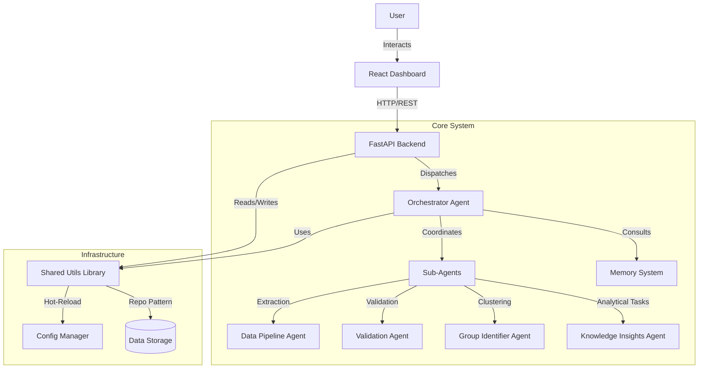

# Agentic Tracking System

Traditional attendance systems fail silently — producing noisy logs, missed anomalies, and reports that arrive too late to act on. The **Agentic Tracking System** closes that gap. It is an AI-native platform that transforms raw badge check-in data into real-time, actionable intelligence — empowering academic administrators and advisors to detect fraud, surface behavioral patterns, and query their entire attendance dataset in plain English. Powered by an orchestrated fleet of specialized AI agents, the platform automates the full data lifecycle: from ingestion and validation to cohort clustering and insight delivery, all without requiring manual intervention.

---

## Index

- [Demo & Resources](#demo--resources)
- [Executive Summary](#executive-summary)
- [System Architecture](#system-architecture)
- [Key Features](#key-features)
- [Component Overview](#component-overview)
- [Getting Started](#getting-started)
  - [Prerequisites](#prerequisites)
  - [Installation](#installation)
  - [Running the System](#running-the-system)
- [Configuration](#configuration)
- [Development](#development)
- [License](#license)

---

## Demo & Resources

### Demo Video

> *A walkthrough demo video will be added here.*

---

### Reports & Documentation

| Document | Description |
| :--- | :--- |
| [System Report](./Reports/Agentic%20Tracking%20System%20Report%20-%20Mohamad%20Faraj%20Makkawi.pdf) | Full system technical report covering implementation, architecture decisions, and results. |
| [Design & Proposal](./Reports/Design_and_Proposal_of_an_Intelligent_Workflow_Tracking_and_Automation_System_for_University_Operations.pdf) | Original design proposal for the Intelligent Workflow Tracking and Automation System for University Operations. |

---


## Executive Summary

The **Agentic Tracking System** solves the challenges of noisy, incomplete, and proxy-plagued badge-based attendance data. By integrating automated data ingestion, multi-layer validation, graph-based cohort analysis (using the Louvain community detection algorithm), and natural-language query resolution, the platform converts raw event logs into actionable strategic insights. Administrators and academic advisors can monitor cohort engagement, detect attendance anomalies, and explore student behaviors through direct natural-language interactions.

---

## System Architecture

The platform follows a modular microservices-inspired architecture that separates dashboard, API, agent orchestration, and shared utilities.


```mermaid
graph TD
    User[User] -->|Interacts| Dashboard[React Dashboard]
    Dashboard -->|HTTP/REST| API[FastAPI Backend]
    
    subgraph Core_System["Core System"]
        API -->|Dispatches| Orchestrator[Orchestrator Agent]
        Orchestrator -->|Consults| Memory[Memory System]
        Orchestrator -->|Coordinates| SubAgents[Sub-Agents]
        
        SubAgents -->|Analytical Tasks| KnowledgeInsights[Knowledge Insights Agent]
        SubAgents -->|Clustering| GroupIdentifier[Group Identifier Agent]
        SubAgents -->|Validation| Validation[Validation Agent]
        SubAgents -->|Extraction| DataPipeline[Data Pipeline Agent]
    end
    
    subgraph Infrastructure
        API -->|Reads/Writes| Utils[Shared Utils Library]
        Orchestrator -->|Uses| Utils
        Utils -->|Repo Pattern| Storage[(Data Storage)]
        Utils -->|Hot-Reload| Config[Config Manager]
    end
```

---

## Key Features

- **Orchestrated Agentic Workflows**
  A central Orchestrator agent routes tasks using a **Tool-Calling** approach. It enforces an **Insight-First** resolution policy, leveraging existing memory context before escalating to more expensive sub-agent execution workflows.

- **Intelligent Memory System**
  Features a robust memory layer supporting **Short-Term Memory** with session isolation. This keeps context intact across multi-turn interactions while keeping independent chat sessions secure and private.

- **Robust Data Pipeline & Repositories**
  Implements a unified **Repository Pattern** to handle multiple formats (`JSON`, `JSONL`, `CSV`, `ICS`) transparently. The preprocessor cleans raw logs, deduplicates scans, constructs sessions, and enriches them with calendar schedules.

- **Background Event Scheduling**
  An asynchronous background task that monitors calendar events (`pass.ics`). It automatically triggers Orchestrator workflows precisely when scheduled classes or sessions reach their end time, ensuring autonomous and timely data updates.

- **Dynamic "Hot-Reload" Configuration**
  A thread-safe configuration manager that supports real-time settings updates from `config.json` without system downtime. Includes dot-notation access and secure environment variable integration.

- **"Deep Ocean" Dashboard**
  A stunning, high-performance web interface built with React, Vite, and vanilla CSS. Features glassmorphism effects, interactive D3-based analytics (engagement matrices, identified clusters, session timelines), and a responsive layout for monitoring system health.

---

## Component Overview

| Component | Directory | Description |
| :--- | :--- | :--- |
| **Dashboard** | [`/dashboard`](./dashboard/README.md) | The "Deep Ocean" frontend. React + Vite + Vanilla CSS. |
| **API** | [`/api`](./api/README.md) | The RESTful backend. FastAPI service for client requests, scheduling, and agent orchestration. |
| **Agents** | [`/agents`](./agents/README.md) | The intelligence layer. Contains Orchestrator, Sub-Agents, and the Memory System. |
| **Utils** | [`/utils`](./utils/README.md) | The core shared library. Implements Storage Repositories, Config Manager, mappers, and AI model wrappers. |

---

## Getting Started

### Prerequisites

- **Python**: 3.10 or higher
- **Node.js**: 18.0.0 or higher
- **npm**: 9.0.0 or higher

### Installation

1. **Clone the repository:**
   ```bash
   git clone https://github.com/MoMakkawi/Agentic_tracking_system
   cd Agentic_tracking_system
   ```

2. **Install Python dependencies:**
   The repository uses PDM to manage the workspace dependencies. You can install all modules in editable mode by running the following command from the root directory:
   ```bash
   pip install -e ./utils -e ./agents/orchestrator -e ./agents/sub_agents/data_pipeline -e ./agents/sub_agents/data_validation -e ./agents/sub_agents/group_identification -e ./agents/sub_agents/knowledge_insight
   ```

3. **Install Frontend dependencies:**
   ```bash
   cd dashboard
   npm install
   cd ..
   ```

### Running the System

To start the entire system (FastAPI backend + React Dashboard) simultaneously, use the provided runner script:

```bash
python run.py
```

This command will:
1. Start the FastAPI backend on `http://localhost:8000`.
2. Start the React Dashboard on `http://localhost:5173`.
3. Stream logs from both services directly to your terminal.

---

## Configuration

The system is configured through `config.json`, which is managed by the thread-safe config loader in `utils`.
- **Hot-Reloading**: Changes to `config.json` are applied immediately without restarting the application.
- **Structure**: Organized by subsystem (Scheduler, Source URLs, Paths, LLM Modules).
- **Secrets**: Environment variables (such as `API_KEYS.GEMINI`) can be configured via a `.env` file.

---

## Development

- **Swagger UI**: Visit `http://localhost:8000/docs` while the backend is running to explore and test endpoints.
- **Sub-Agents**: Located in `agents/sub_agents/`, each following a specialized task specification.
- **Memory**: Managed under `agents/memory/`, providing conversation state isolation.

---

## License

This project is licensed under the MIT License.
